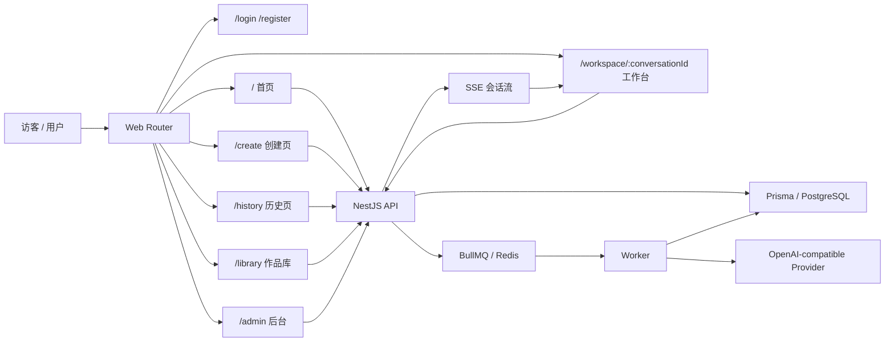
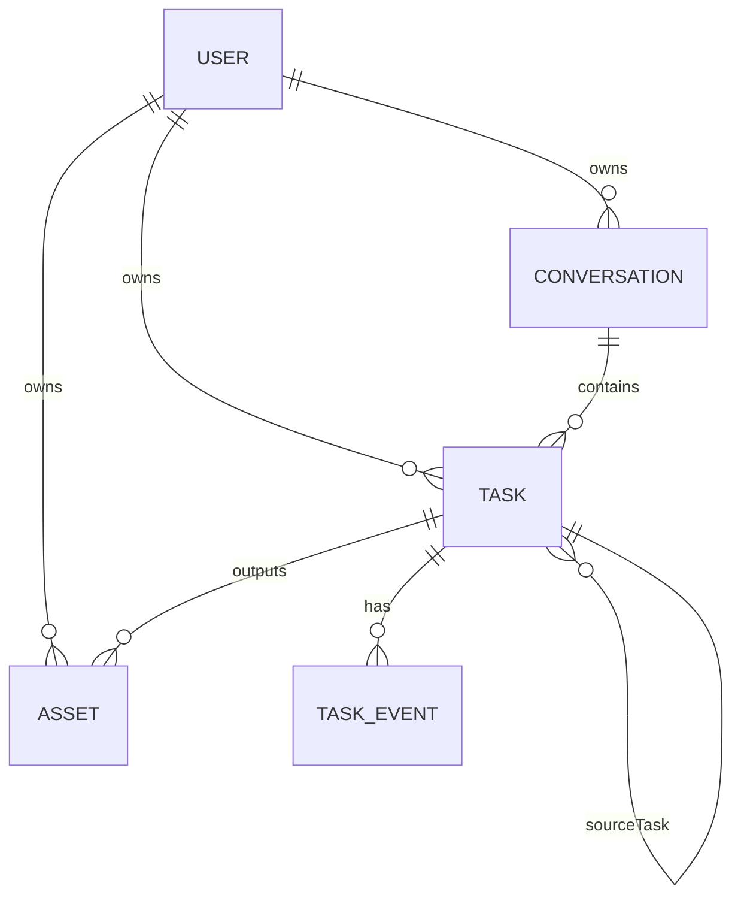
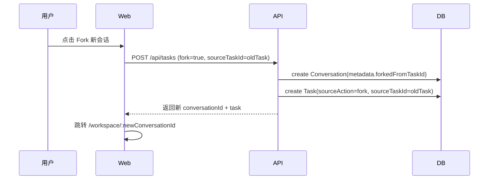

# 技术方案设计

## 1. 文档目标

本文档为 `round-2-personal-user` 的 **Phase 2 技术方案设计**，基于当前仓库真实实现制定，不假设推翻现有 NestJS + Prisma + BullMQ + React 工作台架构；目标是在保留现有会话、任务、事件流、后台诊断能力的前提下，完成个人用户前台重组。

## 2. 已确认产品决策（设计输入）

| 决策项 | 已确认值 | 技术含义 |
| --- | --- | --- |
| 注册方式 | 自注册 | 后端补本地账号注册；前端新增注册页 |
| 会话创建时机 | 懒创建 | 上传不创建空会话；首次提交任务时创建 |
| 继续创作默认落点 | 原会话 | 工作台内后续任务默认沿用原 `conversationId` |
| 是否支持 fork | 支持显式 fork 按钮 | 新建分支会话，但保留来源链 |
| 作品删除策略 | 作品库软删除 | 优先复用现有 `Asset.status=deleted` |
| 失败恢复策略 | 系统类失败一键重试；内容类失败参数回填 | 需把现有失败分类暴露给前端并统一 CTA |

## 3. 当前仓库基线

### 3.1 前端基线

- 技术栈：`Vite + React 19 + react-router-dom + Tailwind + shadcn/ui`
- 当前路由仅有：
  - `/login`
  - `/`（单页工作台）
  - `/admin`
- 当前壳层与能力：
  - `apps/web/src/app.tsx`：基于 `createBrowserRouter`
  - `apps/web/src/lib/auth.tsx`：全局登录态恢复
  - `apps/web/src/lib/api-client.ts`：基于 `fetch` 的 API Client
  - `apps/web/src/pages/workspace-page.tsx`：单页承载会话列表、创作、结果、详情
  - `apps/web/src/components/chat/composer.tsx`：现有创建表单基础能力

### 3.2 后端基线

- 技术栈：`NestJS + Prisma + PostgreSQL + Redis + BullMQ`
- 当前鉴权：
  - `apps/api/src/auth/auth.service.ts` 仅支持内建 `admin/demo`
  - Session 为自签名 Cookie，非数据库 Session
- 当前任务链路：
  - `POST /api/tasks` 需要前置 `conversationId`
  - 上传走 `POST /api/assets/upload`
  - Worker 负责消费队列并写回任务结果
- 当前实时链路：
  - `GET /api/conversations/:id/events` 基于 SSE
- 当前失败恢复：
  - `POST /api/tasks/:id/retry` 已存在
  - 但仅管理员可用
  - 失败分类已在 `task_events.details` 中沉淀 `category / retryable / statusCode`

### 3.3 数据模型基线

当前 Prisma 已有：

- `User`
- `Conversation`
- `Message`
- `Task`
- `Asset`
- `TaskEvent`

其中与本轮最相关的现状：

- `Asset.status` 已有 `deleted`，可直接承接作品库软删除
- `Task.input` 已保存模型、Prompt、素材和参数，可用于“参数回填”
- 重试链当前主要靠 `TaskEvent.details.retryOfTaskId / retryTaskId` 追溯
- 尚无个人用户密码字段、无显式任务来源字段、无 fork 来源字段

## 4. 设计原则

1. **保留现有队列、SSE、Provider、后台诊断模块**
2. **优先增量扩展 DTO / Schema / 路由，不做大规模重写**
3. **前台从“单页状态机”调整为“多页职责分层”，但复用现有组件**
4. **把“继续创作 / 重试 / fork”都收敛到统一的来源链模型**
5. **软删除仅影响作品库展示，不破坏历史链路**

## 5. 总体方案



核心思路：

- 前端拆页，但不拆底层 API Client、鉴权 Context、SSE 机制
- 后端继续以 `Conversation + Task + TaskEvent + Asset` 为核心
- “继续创作 / 重试 / fork”统一建模为“来源任务 + 触发动作”
- 首页 / 历史页 / 作品库新增聚合接口，避免前端自行拼装过多业务判断

## 6. 前端路由重构方案

### 6.1 目标路由树

```text
/login
/register
/
/create
/workspace/:conversationId
/history
/library
/admin
```

### 6.2 路由组织方式

沿用当前 `createBrowserRouter`，拆成三层：

1. **Public Routes**
   - `/login`
   - `/register`
2. **User App Shell**
   - `/`
   - `/create`
   - `/workspace/:conversationId`
   - `/history`
   - `/library`
3. **Admin Route**
   - `/admin`

### 6.3 具体改造方案

- 保留 `AuthProvider`、`RequireAuth`、`RequireAdmin`
- 扩展 `AppShell` 顶部导航，加入首页 / 创建页 / 历史页 / 作品库
- 将当前 `WorkspacePage` 从“内部 state 选中会话”改为“URL 参数驱动会话”
  - 当前 `activeId` 从组件内部状态迁移为 `useParams().conversationId`
  - 当前 `SessionList` 点击行为从 `setActiveId` 改为路由跳转
- 新增 `HomePage`、`CreatePage`、`HistoryPage`、`LibraryPage`、`RegisterPage`
- `/` 不再承载工作台，改为首页

### 6.4 组件复用策略

优先复用现有组件：

- `AppShell`：继续作为登录后主壳层
- `Composer`：抽为可复用创建表单基础组件，供 `/create` 与工作台内继续创作使用
- `SessionList`：继续作为工作台左侧会话列表
- `DetailPanel`：继续承担会话摘要与最近任务
- `apiClient`：继续作为唯一前端 API 访问层
- 原生 `EventSource`：继续用于工作台 SSE

不建议本轮引入：

- `TanStack Query`
- 全局状态管理库
- 前端 BFF

原因：当前代码仍以 `apiClient + useEffect + useState` 为主，P0 更适合先完成路由与语义拆分，而不是同步引入新的状态管理范式。

### 6.5 页面数据职责

| 页面 | 前端主数据源 | 说明 |
| --- | --- | --- |
| 首页 | `GET /api/home` | 聚合最近会话、最近作品、失败恢复卡片 |
| 创建页 | `GET /api/models` + 来源任务详情 | 负责预填与首次提交 |
| 工作台 | `GET /api/conversations/:id` + SSE | 保留当前实时观察主场景 |
| 历史页 | `GET /api/history` | 展示过程而非作品精选 |
| 作品库 | `GET /api/library` | 仅展示成功作品 |

### 6.6 继续创作与 fork 的前端交互

- 工作台结果卡片：
  - 主按钮：`再编辑`
  - 次按钮：`生成变体`
  - 辅助按钮：`Fork 新会话`
- 历史页 / 作品库：
  - 默认 CTA：回来源工作台继续
  - 次级 CTA：去创建页做参数调整
  - 显式 CTA：Fork 新会话

建议使用 query 参数承载短期来源上下文：

```text
/create?fromTaskId=xxx&mode=edit
/create?fromTaskId=xxx&mode=variant&fork=1
/workspace/conv_xxx?resumeTaskId=task_xxx
```

## 7. 后端认证改造方案

## 7.1 目标

在**不引入第三方认证平台**的前提下，把现有“内建账号 + 自签 Cookie”升级为“数据库用户 + 自签 Cookie”。

### 7.2 保留与新增

**保留：**

- 当前 Cookie Session 机制
- `AuthGuard` / `Roles` 鉴权方式
- `GET /api/auth/me`
- `POST /api/auth/logout`

**新增 / 调整：**

- `POST /api/auth/register`
- `POST /api/auth/login` 改为数据库账号登录
- `User` 模型增加密码哈希与角色字段
- Session Payload 从“email + role”改为“userId + role”

### 7.3 用户模型改造

建议新增：

| 字段 | 类型 | 用途 |
| --- | --- | --- |
| `role` | enum(`member`,`admin`,`demo`) | 明确前后台身份边界 |
| `passwordHash` | string? | 本地账号密码哈希 |
| `passwordUpdatedAt` | datetime? | 便于后续会话失效与审计 |

说明：

- 现有 `metadata.role` 继续保留一段过渡期，作为兼容字段
- 真正的权限判断以后端 `role` 列为准
- `member` 作为个人用户默认角色

### 7.4 密码方案

优先新增开源库：`argon2`

理由：

- 比自行实现哈希安全
- 比把明文密码继续留在配置里更适合自注册
- 与当前 NestJS 服务层集成成本低

### 7.5 Built-in 账号兼容

当前 `admin/demo` 不直接删除，而是调整为：

- 启动时仍根据 env 确保 `admin/demo` 账号存在
- 账号落库为标准 `User`
- 密码改为哈希后存储
- 普通前台 UI 不再展示 demo 提示词
- `/admin` 仍仅允许 `admin`

### 7.6 Session 方案

当前 Session 仍保持无状态 Cookie：

- Cookie 内容：`sub(userId) + role + exp + signature`
- `authenticateRequest()` 改为：
  1. 解析 Cookie
  2. 校验签名与过期时间
  3. 通过 `userId` 查询数据库用户
  4. 校验角色是否仍有效

优点：

- 不需要新增 Session 表
- 与当前代码风格一致
- 改造范围集中在 `auth.service.ts`

风险：

- 旧 Cookie 需要失效处理
- 建议上线时统一强制重新登录

## 8. 数据模型改动

### 8.1 不新增“作品表”

本轮**不新增独立作品表**，原因：

- 当前成功产物本质上就是 `Asset(type=generated)`
- 来源关系已挂在 `Task / Conversation`
- 作品库只是“成功结果的聚合视图”，不是新的业务主实体

### 8.2 Prisma 变更建议

#### `User`

- 新增 `role`
- 新增 `passwordHash`
- 新增 `passwordUpdatedAt`

#### `Task`

建议新增：

| 字段 | 类型 | 用途 |
| --- | --- | --- |
| `sourceTaskId` | string? | 继续创作 / retry / fork 的来源任务 |
| `sourceAction` | string? | `retry` / `edit` / `variant` / `fork` |

设计意图：

- 当前 retry 关系只存在于 `TaskEvent.details`
- 增加显式字段后，历史页、作品库、工作台都能直接拿到来源链
- 老数据仍可通过现有 `TaskEvent.details.retryOfTaskId` 回溯，兼容历史记录

#### `Conversation`

不强制新增列，优先复用 `metadata`：

```json
{
  "forkedFromConversationId": "...",
  "forkedFromTaskId": "..."
}
```

原因：

- fork 来源更多是展示与追溯信息
- 当前不需要按 fork 来源做高频数据库筛选
- 放在 `metadata` 可减少 schema 改动面

#### `Asset`

本轮不新增新表；优先复用：

- `type=generated`
- `status=deleted`

如需补充删除时间，可先写入 `metadata.deletedAt`，不阻塞 P0。

### 8.3 关系约束



## 9. API 变更方案

### 9.1 认证接口

#### 新增 `POST /api/auth/register`

请求：

```json
{
  "email": "user@example.com",
  "password": "******",
  "displayName": "可选"
}
```

响应：

```json
{
  "user": {
    "id": "usr_xxx",
    "email": "user@example.com",
    "role": "member"
  }
}
```

#### 调整 `POST /api/auth/login`

- 从“仅内建账号校验”改为“数据库用户校验”
- `admin/demo/member` 共用统一登录口

### 9.2 首页聚合接口

#### 新增 `GET /api/home`

返回：

- 最近会话
- 最近任务
- 最近作品
- 待恢复失败项

原因：首页是聚合视图，前端不应自行拼装 4 类接口并重复做业务分类。

### 9.3 创建 / 继续创作接口

#### 调整 `POST /api/tasks`

当前 `conversationId` 为必填；改造后建议支持：

```json
{
  "conversationId": "可选",
  "capability": "image.generate",
  "model": "gpt-image-1",
  "prompt": "xxx",
  "assetIds": ["..."],
  "params": {},
  "sourceTaskId": "可选",
  "sourceAction": "retry|edit|variant|fork",
  "fork": false
}
```

服务端行为：

1. `conversationId` 有值且 `fork=false`
   - 沿用原会话创建任务
2. `conversationId` 为空
   - 懒创建新会话，再创建任务
3. `fork=true`
   - 创建新会话
   - 在新会话中创建任务
   - 把 fork 来源写入 `Conversation.metadata`

这样可以在**不新增独立 orchestration endpoint** 的前提下，兼容：

- 首次创建
- 原会话继续创作
- fork 新会话

### 9.4 历史接口

#### 新增 `GET /api/history`

返回建议为任务视角列表，附带会话信息：

```json
{
  "items": [
    {
      "taskId": "task_xxx",
      "conversationId": "conv_xxx",
      "status": "failed",
      "capability": "image.edit",
      "promptPreview": "...",
      "failureCategory": "invalid_request",
      "retryable": false,
      "sourceTaskId": "task_prev",
      "sourceAction": "variant"
    }
  ]
}
```

### 9.5 作品库接口

#### 新增 `GET /api/library`

查询规则：

- 仅 `type=generated`
- 仅成功来源任务
- 仅当前用户
- 排除 `status=deleted`

#### 新增 `DELETE /api/library/assets/:id`

执行：

- 把 `Asset.status` 置为 `deleted`
- 可选写入 `metadata.deletedAt`
- 不删文件、不删任务、不删事件

### 9.6 失败恢复接口

#### 调整 `POST /api/tasks/:id/retry`

从“管理员专用”调整为：

- 任务所属用户可调用
- 管理员仍可调用

服务端校验：

- 仅失败任务可重试
- 仅 `retryable=true` 的系统类失败允许前台一键重试
- `invalid_request` 等内容类失败不直接走 retry，而是引导前端使用参数回填

### 9.7 任务详情补充字段

当前 `TaskRecord` 只有 `inputSummary`，不足以支持创建页精确回填。建议扩展：

```json
{
  "task": {
    "id": "task_xxx",
    "capability": "image.edit",
    "modelId": "gpt-image-1",
    "prompt": "完整 prompt",
    "assetIds": ["asset_xxx"],
    "params": {},
    "sourceTaskId": "task_prev",
    "sourceAction": "edit",
    "failure": {
      "category": "invalid_request",
      "retryable": false,
      "title": "Image request rejected",
      "detail": "..."
    }
  }
}
```

实现方式：

- 完整输入从现有 `task.input` 读取
- 失败信息从最近一次 `failed` 事件的 `details` 读取
- 无需新增单独 recovery endpoint

## 10. 继续创作与 fork 机制

### 10.1 统一来源链模型

后续任务都统一写入：

- `sourceTaskId`
- `sourceAction`

映射关系：

| 用户动作 | `sourceAction` | 会话行为 |
| --- | --- | --- |
| 一键重试 | `retry` | 原会话 |
| 再编辑 | `edit` | 默认原会话 |
| 生成变体 | `variant` | 默认原会话 |
| Fork 创作 | `fork` | 新会话 |

### 10.2 工作台内继续创作

流程：

1. 用户在工作台选中成功结果
2. 点击“再编辑”或“生成变体”
3. 前端带 `sourceTaskId` 与来源素材发起 `POST /api/tasks`
4. 后端直接在当前 `conversationId` 下创建新任务

### 10.3 Fork 创作

流程：

1. 用户点击 `Fork 新会话`
2. 前端发起 `POST /api/tasks`，携带 `fork=true`
3. 后端创建新 `Conversation`
4. 新任务落在新会话中
5. `Conversation.metadata` 记录 fork 来源
6. 前端跳转到新 `/workspace/:conversationId`



### 10.4 历史与作品库入口

- 默认动作：回来源工作台继续
- 创建页承担“调整参数后继续”
- fork 作为显式次级动作，不和默认继续创作混淆

## 11. 作品库软删除方案

### 11.1 数据策略

- 不硬删 `Asset`
- 不硬删对象存储文件
- 不改写 `Task.output.assetIds`
- 仅把 `Asset.status` 置为 `deleted`

### 11.2 查询策略

| 场景 | 是否排除 `deleted` |
| --- | --- |
| 作品库列表 | 是 |
| 首页最近作品 | 是 |
| 工作台历史追溯 | 否 |
| 历史页来源链 | 否 |

原因：

- 作品库删除是“从资产陈列中移除”
- 不是“从创作历史中抹去”

### 11.3 风险控制

若工作台和历史页也错误过滤了 `deleted` 资产，会导致来源链断裂；因此实现时必须把“展示过滤”限定在作品库查询层，而不是全局 asset 查询层。

## 12. 失败恢复方案

### 12.1 现有能力复用

当前 `TaskExecutionService` 已在失败事件中写入：

- `category`
- `retryable`
- `statusCode`
- 用户可读标题 / 描述

因此本轮重点不是重写失败分类，而是**把已有分类稳定暴露给前端**。

### 12.2 前台动作映射

建议将失败分成三类：

| 失败类 | 当前典型 category | 默认动作 |
| --- | --- | --- |
| 系统波动类 | `rate_limited` / `provider_unavailable` / `provider_network` / `unknown` | 一键重试 |
| 内容问题类 | `invalid_request` | 参数回填到创建页 |
| 配置异常类 | `provider_auth` | 展示不可用说明，不开放成功承诺型 CTA |

### 12.3 接口与 DTO

建议在任务 DTO 中增加：

```ts
failure?: {
  category: string;
  retryable: boolean;
  title?: string;
  detail?: string;
  statusCode?: number;
}
```

前端判断规则：

- `retryable=true` 且 category 属于系统类：展示“一键重试”
- `category=invalid_request`：展示“调整后继续”
- `provider_auth`：展示说明文案与禁用态

### 12.4 参数回填

创建页回填依赖：

- `task.prompt`
- `task.modelId`
- `task.capability`
- `task.assetIds`
- `task.params`

因此必须把现有 `task.input` 的完整可编辑字段向前端开放给任务详情 / 创建页，而不是只有摘要字段。

### 12.5 重试行为

继续沿用当前后端语义：

- 重试创建新任务
- 原失败任务保留
- 通过 `sourceTaskId=原任务ID` 与 `sourceAction=retry` 做显式链路
- 同时兼容保留 `TaskEvent.details.retryTaskId`

## 13. 优先借用的开源组件 / 保留现有实现

### 13.1 优先借用 / 新增

| 组件 / 库 | 用途 | 结论 |
| --- | --- | --- |
| `argon2` | 密码哈希 | 新增，优先使用 |
| `react-router-dom` | 前端分层路由 | 继续复用现有 |
| `shadcn/ui` | 表单、卡片、导航 UI | 继续复用现有 |
| 原生 `EventSource` | 工作台实时状态 | 继续复用现有 |
| `@nestjs/testing` + `supertest` | 后端接口回归 | 建议补齐 |
| `vitest` + React Testing Library | 前端页面回归 | 若实施期允许新增测试依赖则补齐 |

### 13.2 明确保留现有实现

以下能力本轮不重构：

- `BullMQ` 队列模型
- Worker 与 API 双进程拆分
- `OpenAICompatibleService`
- 会话级 SSE 机制
- `apiClient` 的 `fetch` 封装
- `class-validator` DTO 校验
- `/admin` 后台诊断能力

### 13.3 明确不做

- 不引入 OAuth / 第三方认证平台
- 不引入新的图片工作流编排层
- 不引入新的“作品表”或“收藏表”
- 不把前端整体切到新的数据管理框架

## 14. 测试策略与回归范围

### 14.1 当前现实约束

- 仓库当前几乎没有自动化测试落地
- 现有脚本以 `pnpm -r lint` / `tsc --noEmit` 为主
- 因此 Phase 2 的测试策略必须分层：**最小自动化 + 明确人工回归清单**

### 14.2 后端测试重点

优先覆盖：

1. 注册成功 / 重复邮箱 / 弱密码
2. 登录成功 / 密码错误 / 旧 Cookie 失效
3. 懒创建会话：无 `conversationId` 创建任务时自动建会话
4. 原会话继续创作：任务仍落在原会话
5. fork：创建新会话并保留来源链
6. 作品库软删除：列表消失但任务追溯仍可访问
7. 系统类失败 retry：仅创建新任务，不覆盖旧任务
8. 内容类失败：任务详情可返回完整参数草稿

### 14.3 前端测试重点

优先覆盖：

1. 未登录访问受保护路由的跳转恢复
2. 注册成功后自动进入首页
3. 创建页上传素材但不产生空会话
4. 工作台“继续创作默认原会话”
5. `Fork 新会话` 后跳到新工作台
6. 作品删除后从作品库消失，但来源页仍可打开
7. 失败卡片根据失败类型展示不同 CTA

### 14.4 建议回归清单

#### 必回归 P0 用户流

1. 自注册 -> 登录 -> 首页
2. 文生图首次创建 -> 懒创建会话 -> 工作台看到任务
3. 上传图编辑 -> 任务成功 -> 继续创作仍在原会话
4. 从结果点击 fork -> 新会话创建成功
5. 从作品库删除 -> 作品库消失，但历史追溯保留
6. 系统类失败 -> 一键重试 -> 新任务产生
7. 内容类失败 -> 创建页参数回填成功

#### 必回归后台兼容流

1. 管理员仍能登录
2. `/admin` 仍仅管理员可见
3. Provider 检查 / 测试生图不受前台改造影响
4. Worker 恢复、SSE 推送与现有任务执行链不回退

## 15. 主要风险与建议

### 15.1 主要风险

1. **认证改造风险**
   - 从内建账号切到数据库账号，会触达 `auth.service.ts`、Cookie payload、用户表迁移
2. **历史链补齐风险**
   - 旧数据没有 `sourceTaskId`，需要保留对 `TaskEvent.details.retryOfTaskId` 的兼容解析
3. **软删除误伤风险**
   - 若把 `deleted` 过滤做成全局逻辑，会破坏工作台与历史追溯
4. **工作台路由化风险**
   - 当前 `WorkspacePage` 内部持有会话选择状态，改成 URL 驱动时需注意 SSE 重连与轮询清理

### 15.2 实施建议

建议 Phase 3 拆成以下顺序：

1. 先做后端认证与用户模型改造
2. 再做 `POST /api/tasks` 的懒创建 / fork 能力
3. 再做任务 DTO 的 failure / source 扩展
4. 最后落前端路由拆分与页面接线

这样可以最大程度降低“前后端同时大改导致联调面过宽”的风险。

## 16. 结论

本方案的核心不是“重写一套新系统”，而是基于当前仓库已经存在的会话、任务、SSE、重试与资产模型，补上**个人用户认证、自注册、多页路由分层、继续创作 / fork 语义、作品软删除与失败恢复映射**。  
Phase 2 推荐按“认证 -> 任务链 -> 聚合接口 -> 前端拆页”的顺序推进，以最低回归成本完成第二轮个人用户版落地。
