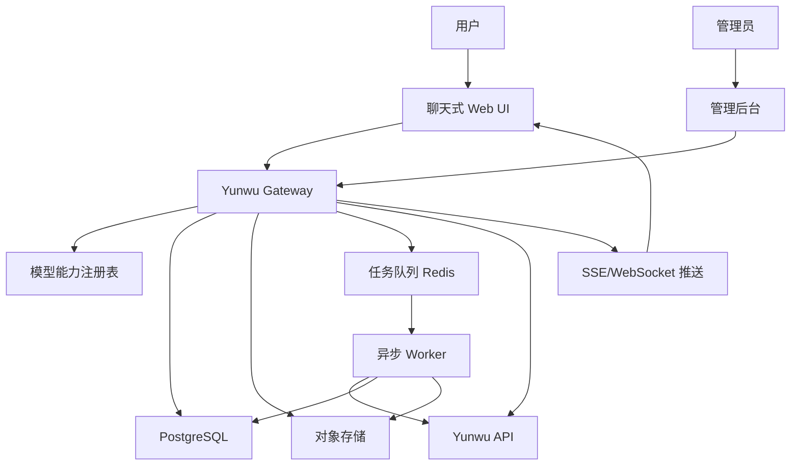
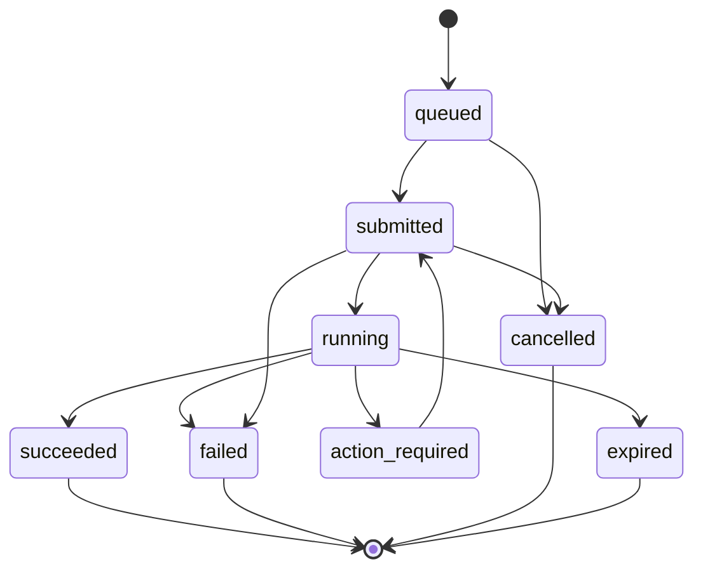

# Yunwu Image Chat Platform PRD

## 1. 文档信息

- 产品名称：Yunwu Image Chat Platform
- 文档版本：v1.0
- 编写日期：2026-04-22
- 关联 API 文档：`yunwu-image-api.md`
- 目标形态：覆盖 Yunwu `绘画模型` 全部 API 能力的聊天式图像生成与编辑平台

## 2. 背景与目标

### 2.1 背景

Yunwu `绘画模型` 文档下包含多类图像相关 API：

- OpenAI-compatible 图像接口，例如 `/v1/images/generations`、`/v1/images/edits`
- Midjourney 任务型接口，例如 `/mj/submit/imagine`、`/mj/task/*`
- Ideogram 图像生成、编辑、重构、混合、放大、描述接口
- FLUX / Replicate 任务提交与查询接口
- Fal.ai 任务提交与查询接口
- 腾讯 AIGC 生图任务接口
- 豆包、Grok Image、DALL·E、Qwen 等 OpenAI 风格图像接口

这些接口存在明显差异：

- 同步接口与异步任务接口并存
- 文生图、图生图、编辑、蒙版、描述、放大、背景替换等能力并存
- 上传、任务查询、二次动作、结果复用等流程差异较大
- 各模型参数、返回结构、状态码和错误格式不统一

因此，平台不能仅作为简单 API 调试器。需要通过统一能力抽象、任务状态机和聊天式 UI，将所有接口能力包装成用户可理解、可操作、可复用的图像创作工作台。

### 2.2 产品目标

- 覆盖 `yunwu-image-api.md` 中 `绘画模型` 下全部 API 功能
- 提供聊天式 UI，用户通过自然语言、图片上传和参数面板完成图像生成/编辑
- 对不同厂商接口做统一封装，隐藏 API 协议差异
- 支持异步任务提交、轮询、状态展示、失败重试和结果管理
- 支持生成结果的二次操作，例如继续编辑、参考图复用、放大、重绘、混合、描述
- 提供管理后台，用于模型配置、任务审计、失败诊断和接口调试

### 2.3 非目标

- 不训练自有模型
- 不做公开模型市场
- 不做复杂商业计费系统的完整实现，MVP 仅保留配额与调用记录基础能力
- 不替代 Yunwu API 的鉴权与账单体系，仅做平台侧用户与调用管理

## 3. 用户角色

### 3.1 普通创作者

- 使用聊天界面输入 prompt
- 上传参考图、mask、素材图
- 选择模型、尺寸、风格、数量
- 查看任务进度和生成结果
- 对结果继续编辑、重跑或下载

### 3.2 高级用户

- 精细调整模型参数
- 使用 Midjourney action、Ideogram remix/reframe、FLUX edit 等高级能力
- 管理历史素材和任务
- 对比不同模型生成效果

### 3.3 管理员

- 配置 Yunwu API Key
- 配置模型能力、参数约束和默认值
- 查看调用日志、失败任务和原始请求/响应
- 重试、取消或标记异常任务
- 管理用户权限和配额

## 4. 产品范围

### 4.1 必须覆盖的 API 分组

平台必须覆盖以下分组能力，具体接口以 `yunwu-image-api.md` 为准：

- Midjourney
- Ideogram
- GPT Image 系列
- Grok Image 系列
- DALL·E 3
- FLUX 系列
- 豆包系列
- Fal.ai 平台
- 腾讯 AIGC 生图
- 千问 Qwen 系列

### 4.2 核心能力分类

| 能力 | 说明 | 示例分组 |
| --- | --- | --- |
| 文生图 | 用户输入 prompt 生成图片 | GPT Image、DALL·E、豆包、Qwen、Ideogram、Fal.ai |
| 图生图 | 基于参考图生成新图 | FLUX、Fal.ai、部分编辑接口 |
| 图片编辑 | 对已有图片进行局部或整体编辑 | GPT Image、Grok Image、Ideogram、FLUX |
| 蒙版编辑 | 上传图片与 mask 后编辑 | GPT Image |
| 图像描述 | 根据图片生成描述 | Ideogram、Midjourney describe |
| 混图/重混 | 多图或图文混合生成 | Midjourney blend、Ideogram remix |
| 放大高清 | 对图片做 upscale | Ideogram upscale、Midjourney action |
| 背景替换 | 替换图片背景 | Ideogram replace-background |
| 异步任务查询 | 提交任务后轮询结果 | Midjourney、Fal.ai、Replicate、腾讯 AIGC |
| 二次动作 | 对已生成任务执行 action | Midjourney action/modal |

## 5. 总体方案

### 5.1 推荐技术路线

- 用户前台：Fork Open WebUI 或借鉴其聊天 UI 结构
- 后端网关：自研 Gateway/Orchestrator，建议 FastAPI 或 NestJS
- 异步任务：Redis + Celery/RQ/BullMQ
- 数据库：PostgreSQL
- 缓存：Redis
- 文件存储：本地开发使用 MinIO，生产使用 S3/COS/R2 等对象存储
- 管理后台：ToolJet/Budibase/Appsmith 可选；MVP 可先做简单后台页面

### 5.2 架构图



### 5.3 核心设计原则

- 前端不直接感知 Yunwu 原始 API 差异
- 所有模型能力通过统一能力注册表暴露
- 所有异步任务通过统一任务状态机管理
- 所有生成结果先进入资产系统，再展示给用户
- 所有原始请求/响应可审计，但默认不暴露给普通用户

## 6. 功能需求

## 6.1 聊天工作台

### 6.1.1 会话列表

用户可以：

- 新建图像创作会话
- 查看历史会话
- 搜索会话标题
- 删除会话
- 重命名会话

会话需要记录：

- 用户输入
- 平台回复
- 任务卡片
- 生成图片
- 使用模型
- 关联资产

### 6.1.2 聊天输入区

输入区支持：

- 文本 prompt
- 图片上传
- 多图上传
- mask 上传
- 拖拽上传
- 模型选择
- 能力选择
- 参数展开面板

参数面板支持：

- 图片数量
- 尺寸/比例
- seed
- style
- quality
- negative prompt
- response format
- provider-specific 参数

参数需要由后端能力注册表动态返回，前端不能硬编码所有模型参数。

### 6.1.3 消息类型

前端需要支持以下消息类型：

| 类型 | 用途 |
| --- | --- |
| `text` | 普通文本消息 |
| `image_result` | 单图结果 |
| `image_grid` | 多图结果 |
| `task_card` | 异步任务状态卡片 |
| `upload_card` | 上传结果 |
| `action_card` | 可执行二次动作 |
| `error_card` | 错误信息 |
| `system_notice` | 系统提示 |

### 6.1.4 任务卡片

任务卡片展示：

- 任务名称
- 使用模型
- 当前状态
- 进度
- 提交时间
- 耗时
- 输入摘要
- 当前输出
- 错误信息
- 可用操作

状态包括：

- `queued`
- `submitted`
- `running`
- `succeeded`
- `failed`
- `cancelled`
- `expired`
- `action_required`

### 6.1.5 图片结果卡片

图片结果卡片支持：

- 预览
- 下载
- 复制 URL
- 查看原图
- 继续编辑
- 作为参考图
- 作为 mask 源图
- 重新生成
- 查看生成参数
- 加入素材库

## 6.2 模型与能力选择

### 6.2.1 能力分类

前端不直接展示 API 路径，而展示能力：

- 文生图
- 图片编辑
- 蒙版编辑
- 图像描述
- 图像放大
- 背景替换
- 混图
- 任务查询
- Midjourney 动作

### 6.2.2 模型列表

模型列表字段：

- 模型名称
- provider
- 能力类型
- 是否同步
- 是否需要上传图片
- 支持文件类型
- 参数 schema
- 默认参数
- API 状态
- 是否启用

### 6.2.3 能力匹配逻辑

当用户上传图片或选择某种操作时，前端自动过滤不支持该能力的模型。

示例：

- 仅输入 prompt：展示文生图模型
- 上传图片：展示图片编辑、图生图、描述、混图模型
- 上传 mask：展示支持蒙版编辑的模型
- 点击 Midjourney 结果 action：仅展示该任务支持的动作

## 6.3 文件与素材系统

### 6.3.1 上传能力

支持：

- PNG
- JPG/JPEG
- WebP
- GIF 可选

基础校验：

- 文件类型
- 文件大小
- 图片尺寸
- 是否透明通道
- 是否符合 API 限制

Yunwu README 明确提到创建图像时若需上传图片文件，本地上传 `.png` 文件需小于 `4MB`。平台应在上传阶段做前置校验。

### 6.3.2 资产管理

所有上传与生成结果进入资产表：

- 原始文件名
- 存储路径
- MIME
- 文件大小
- 宽高
- 来源类型
- 所属用户
- 所属会话
- 关联任务
- 缩略图

### 6.3.3 图片复用

用户可以：

- 从历史结果选择图片继续编辑
- 选择多张图片作为 blend/remix 输入
- 选择图片作为 mask 基图
- 选择图片作为参考图

## 6.4 Yunwu Gateway

### 6.4.1 统一入口

后端对前端暴露统一接口：

- `GET /api/capabilities`
- `GET /api/models`
- `POST /api/assets/upload`
- `POST /api/tasks`
- `GET /api/tasks/{task_id}`
- `POST /api/tasks/{task_id}/actions`
- `POST /api/chat`
- `GET /api/conversations`
- `GET /api/conversations/{id}`

### 6.4.2 Adapter 抽象

每类外部接口实现一个 adapter：

- `OpenAIImageAdapter`
- `MidjourneyAdapter`
- `IdeogramAdapter`
- `FluxAdapter`
- `FalAiAdapter`
- `ReplicateAdapter`
- `TencentAigcAdapter`
- `QwenImageAdapter`

统一接口：

```ts
interface ImageAdapter {
  submit(input: UnifiedTaskInput): Promise<UnifiedTaskSubmission>;
  fetch?(externalTaskId: string): Promise<UnifiedTaskState>;
  cancel?(externalTaskId: string): Promise<UnifiedTaskState>;
  actions?(task: Task): Promise<ActionDescriptor[]>;
  invokeAction?(task: Task, action: ActionInput): Promise<UnifiedTaskSubmission>;
}
```

### 6.4.3 同步与异步处理

同步接口：

- Gateway 直接调用 Yunwu
- 解析结果
- 保存资产
- 返回 `succeeded` 任务

异步接口：

- Gateway 创建内部任务
- Worker 调用 Yunwu submit
- 保存外部 task id
- Worker 定时 fetch
- 状态变化后写库
- 前端通过 SSE/WebSocket 或轮询获取状态

## 6.5 任务系统

### 6.5.1 任务状态机



### 6.5.2 任务记录

任务必须记录：

- 内部 task id
- 外部 task id
- provider
- capability
- model
- conversation id
- message id
- user id
- status
- progress
- input JSON
- normalized output JSON
- raw request
- raw response
- error code
- error message
- retry count
- created at
- updated at
- completed at

### 6.5.3 轮询策略

默认策略：

- 第 0-30 秒：每 3 秒轮询一次
- 第 30-180 秒：每 8 秒轮询一次
- 第 180 秒后：每 20 秒轮询一次
- 超过模型配置的最大等待时间后标记 `expired`

不同 provider 可覆盖默认策略。

### 6.5.4 重试策略

仅对以下情况自动重试：

- 网络超时
- 5xx
- 临时性网关错误

不自动重试：

- 鉴权失败
- 参数错误
- 文件格式错误
- 余额不足
- provider 明确返回不可重试错误

## 6.6 Midjourney 能力

覆盖：

- 上传图片
- Imagine
- 查询单任务
- 批量查询
- 获取 seed
- Action
- Blend
- Describe
- Modal

UI 要求：

- Imagine 返回任务卡片
- 任务成功后展示图片网格
- 结果卡片展示可用 action
- 支持 U/V/reroll 等动作按钮，具体动作以后端返回为准
- Describe 结果以文本消息展示

## 6.7 Ideogram 能力

覆盖：

- v3 generate
- v3 edit
- v3 remix
- v3 reframe
- v3 replace-background
- legacy generate
- remix
- upscale
- describe

UI 要求：

- generate 使用 prompt 输入
- edit/remix/reframe/replace-background 必须支持图片输入
- describe 输出文本
- upscale 输出图片资产

## 6.8 GPT Image / Grok / DALL·E / 豆包 / Qwen

这些优先归入 OpenAI-compatible 图像能力。

覆盖：

- `/v1/images/generations`
- `/v1/images/edits`

UI 要求：

- 文生图表单
- 图片编辑表单
- 蒙版编辑表单
- 支持 `model` 参数动态切换
- 根据模型配置限制尺寸、数量、质量等参数

注意：

- Qwen 分组中部分接口在文档状态为 `-2`，默认应在前台隐藏，管理员可手动启用。

## 6.9 FLUX / Replicate 能力

覆盖：

- OpenAI DALL·E 风格 FLUX 创建
- OpenAI DALL·E 风格 FLUX 编辑
- Replicate FLUX 任务创建
- Replicate 任务查询

UI 要求：

- OpenAI 风格接口走同步/标准适配
- Replicate 风格接口走异步任务卡片
- 查询接口由任务系统自动调用，普通用户不直接操作

## 6.10 Fal.ai 能力

覆盖：

- 请求结果查询
- nano-banana 文生图
- nano-banana edit

UI 要求：

- 提交后生成任务卡片
- 查询接口由任务系统处理
- 支持结果图片入库

## 6.11 腾讯 AIGC 生图

覆盖：

- 创建任务
- 查询任务

UI 要求：

- 创建任务后展示任务卡片
- 查询任务由 Worker 自动处理
- 支持失败重试和超时标记

## 6.12 管理后台

### 6.12.1 模型配置

管理员可以：

- 启用/禁用模型
- 编辑展示名称
- 编辑能力类型
- 编辑默认参数
- 编辑参数限制
- 编辑是否异步
- 编辑最大超时时间

### 6.12.2 任务管理

管理员可以：

- 查看所有任务
- 按用户、状态、provider、模型筛选
- 查看原始请求
- 查看原始响应
- 重试失败任务
- 标记任务为失败
- 下载结果

### 6.12.3 API Key 管理

管理员可以：

- 配置 Yunwu API Key
- 测试连通性
- 轮换 Key
- 查看最近调用错误

MVP 阶段可只支持单 Key。

## 7. 用户流程

### 7.1 文生图流程

1. 用户打开聊天工作台
2. 输入 prompt
3. 选择“文生图”
4. 选择模型
5. 调整尺寸、数量等参数
6. 点击发送
7. 平台创建任务
8. 同步接口直接返回结果，异步接口展示任务卡片
9. 结果图片进入消息流和素材库

### 7.2 图片编辑流程

1. 用户上传图片
2. 输入编辑指令
3. 选择“图片编辑”
4. 选择支持图片输入的模型
5. 可选上传 mask
6. 点击发送
7. 平台提交任务
8. 成功后展示编辑结果

### 7.3 Midjourney Action 流程

1. 用户提交 Imagine
2. 平台展示任务卡片
3. 任务成功后展示图片网格
4. 平台展示可用 action
5. 用户点击 action
6. Gateway 提交 action 任务
7. 新任务进入会话流

### 7.4 结果复用流程

1. 用户点击某张结果图
2. 选择“继续编辑”或“作为参考图”
3. 图片自动进入输入区
4. 用户补充 prompt
5. 选择模型后提交

## 8. 数据模型

### 8.1 users

| 字段 | 类型 | 说明 |
| --- | --- | --- |
| id | uuid | 用户 ID |
| email | text | 邮箱 |
| name | text | 昵称 |
| role | text | user/admin |
| status | text | active/disabled |
| created_at | timestamptz | 创建时间 |

### 8.2 conversations

| 字段 | 类型 | 说明 |
| --- | --- | --- |
| id | uuid | 会话 ID |
| user_id | uuid | 用户 ID |
| title | text | 会话标题 |
| created_at | timestamptz | 创建时间 |
| updated_at | timestamptz | 更新时间 |

### 8.3 messages

| 字段 | 类型 | 说明 |
| --- | --- | --- |
| id | uuid | 消息 ID |
| conversation_id | uuid | 会话 ID |
| role | text | user/assistant/system |
| type | text | text/task_card/image_result/error_card |
| content | text | 文本内容 |
| payload | jsonb | 结构化内容 |
| created_at | timestamptz | 创建时间 |

### 8.4 assets

| 字段 | 类型 | 说明 |
| --- | --- | --- |
| id | uuid | 资产 ID |
| user_id | uuid | 用户 ID |
| conversation_id | uuid | 会话 ID |
| task_id | uuid | 任务 ID |
| type | text | upload/generated |
| mime | text | MIME |
| storage_url | text | 存储 URL |
| public_url | text | 访问 URL |
| width | int | 宽度 |
| height | int | 高度 |
| size_bytes | bigint | 文件大小 |
| metadata | jsonb | 元数据 |
| created_at | timestamptz | 创建时间 |

### 8.5 tasks

| 字段 | 类型 | 说明 |
| --- | --- | --- |
| id | uuid | 内部任务 ID |
| external_task_id | text | Yunwu/provider 任务 ID |
| user_id | uuid | 用户 ID |
| conversation_id | uuid | 会话 ID |
| message_id | uuid | 关联消息 ID |
| provider | text | provider |
| capability | text | 能力 |
| model | text | 模型 |
| status | text | 状态 |
| progress | int | 进度 |
| input | jsonb | 统一输入 |
| output | jsonb | 统一输出 |
| raw_request | jsonb | 原始请求 |
| raw_response | jsonb | 原始响应 |
| error_code | text | 错误码 |
| error_message | text | 错误信息 |
| retry_count | int | 重试次数 |
| created_at | timestamptz | 创建时间 |
| updated_at | timestamptz | 更新时间 |
| completed_at | timestamptz | 完成时间 |

### 8.6 model_capabilities

| 字段 | 类型 | 说明 |
| --- | --- | --- |
| id | uuid | 配置 ID |
| provider | text | provider |
| model | text | 模型名 |
| display_name | text | 展示名称 |
| capability | text | 能力 |
| endpoint | text | Yunwu 路径 |
| method | text | HTTP 方法 |
| enabled | boolean | 是否启用 |
| is_async | boolean | 是否异步 |
| input_schema | jsonb | 输入 schema |
| default_params | jsonb | 默认参数 |
| constraints | jsonb | 参数约束 |
| polling_policy | jsonb | 轮询策略 |

## 9. 后端 API 设计

### 9.1 获取能力列表

`GET /api/capabilities`

返回：

```json
{
  "capabilities": [
    {
      "key": "image.generate",
      "name": "文生图"
    }
  ]
}
```

### 9.2 获取模型列表

`GET /api/models?capability=image.generate`

返回：

```json
{
  "models": [
    {
      "id": "gpt-image-1",
      "provider": "openai-compatible",
      "display_name": "GPT Image 1",
      "capabilities": ["image.generate", "image.edit"],
      "params_schema": {}
    }
  ]
}
```

### 9.3 上传资产

`POST /api/assets/upload`

请求：

- `multipart/form-data`
- 字段：`file`

返回：

```json
{
  "asset_id": "uuid",
  "url": "https://...",
  "mime": "image/png",
  "width": 1024,
  "height": 1024
}
```

### 9.4 创建任务

`POST /api/tasks`

请求：

```json
{
  "conversation_id": "uuid",
  "capability": "image.generate",
  "provider": "gpt-image",
  "model": "gpt-image-1",
  "prompt": "一只赛博朋克风格的猫",
  "assets": [],
  "params": {
    "size": "1024x1024",
    "n": 1
  }
}
```

返回：

```json
{
  "task_id": "uuid",
  "status": "queued"
}
```

### 9.5 查询任务

`GET /api/tasks/{task_id}`

返回：

```json
{
  "task_id": "uuid",
  "status": "succeeded",
  "progress": 100,
  "outputs": [
    {
      "type": "image",
      "asset_id": "uuid",
      "url": "https://..."
    }
  ],
  "actions": []
}
```

### 9.6 执行动作

`POST /api/tasks/{task_id}/actions`

请求：

```json
{
  "action": "upscale_1",
  "params": {}
}
```

返回：

```json
{
  "task_id": "uuid",
  "status": "queued"
}
```

## 10. 前端页面设计

### 10.1 页面结构

- 左侧：会话列表
- 中间：聊天消息流
- 右侧：参数面板/素材库/任务详情
- 底部：聊天输入区

### 10.2 主要组件

| 组件 | 说明 |
| --- | --- |
| `ConversationList` | 会话列表 |
| `ChatThread` | 消息流 |
| `Composer` | 输入区 |
| `ModelPicker` | 模型选择 |
| `CapabilityPicker` | 能力选择 |
| `AssetUploader` | 上传组件 |
| `TaskCard` | 任务状态 |
| `ImageResultCard` | 图片结果 |
| `ImageGridCard` | 多图结果 |
| `ActionButtonBar` | 二次动作 |
| `ParamsPanel` | 参数面板 |
| `AssetLibrary` | 素材库 |

### 10.3 聊天消息渲染规则

- 用户 prompt 显示为普通文本
- 上传图片显示缩略图
- 异步任务立即显示任务卡片
- 任务状态变化时实时更新卡片
- 任务成功后插入结果卡片
- 任务失败后显示错误卡片，并允许重试

## 11. 复用与自研边界

### 11.1 可以直接借用

| 来源 | 可借用内容 |
| --- | --- |
| Open WebUI | 聊天 UI 壳层、会话结构、Provider 设置思路、基础图片生成入口 |
| LiteLLM | OpenAI-compatible 代理、标准模型协议统一 |
| ToolJet/Budibase/Appsmith | 管理后台、接口调试、任务 CRUD |
| Dify/n8n | 外围自动化、Webhook 后处理、非核心工作流 |

### 11.2 必须自研

| 模块 | 原因 |
| --- | --- |
| Yunwu Gateway | 需要覆盖私有 API、异步任务、统一响应 |
| Adapter 层 | 各 provider 协议差异大 |
| 任务状态机 | 聊天 UI 与异步任务强绑定 |
| 图片资产系统 | 上传、生成、复用、mask、参考图均依赖 |
| 任务卡片 UI | 原生聊天 UI 不足以表达图像任务流 |
| 能力注册表 | 前端需要能力而不是 API 路径 |
| 统一错误处理 | Yunwu 各接口错误结构不统一 |

## 12. 权限与安全

### 12.1 用户权限

- 普通用户只能查看自己的会话、资产、任务
- 管理员可以查看全局任务、模型配置和调用日志

### 12.2 API Key 安全

- Yunwu API Key 仅保存在服务端
- 前端永不暴露真实 Key
- Key 使用环境变量或密钥管理服务注入
- 原始请求日志需要脱敏 Authorization

### 12.3 文件安全

- 校验 MIME 与扩展名
- 限制文件大小
- 限制图片尺寸
- 对上传文件生成随机路径
- 不信任用户传入的远程 URL，必要时服务端代理拉取并校验

## 13. 监控与日志

### 13.1 需要记录

- 每次 Yunwu 调用
- 请求耗时
- HTTP 状态
- 业务错误码
- 任务状态变化
- Worker 重试次数
- 文件上传失败原因

### 13.2 指标

- 每日任务数
- 成功率
- 平均生成耗时
- 各 provider 错误率
- 超时任务数
- 用户级调用量

## 14. MVP 范围

### 14.1 MVP 必须实现

- 用户登录
- 聊天会话
- 文生图
- 图片编辑
- 图片上传
- 任务卡片
- 结果图片展示
- OpenAI-compatible 图像接口
- Midjourney Imagine / 查询 / Action
- Ideogram generate / edit / remix
- FLUX OpenAI 风格接口
- Fal.ai nano-banana
- 腾讯 AIGC 创建/查询
- 基础管理后台

### 14.2 MVP 暂缓

- 多 Key 负载均衡
- 复杂计费
- 团队空间
- 模型效果评分
- Prompt 模板市场
- 多语言
- 移动端深度适配

## 15. 里程碑

### Phase 1：基础平台

- 搭建 Gateway
- 搭建数据库
- 完成用户、会话、消息
- 完成文件上传
- 完成 OpenAI-compatible 图像生成
- 完成基础聊天 UI

### Phase 2：异步任务

- 完成任务状态机
- 完成 Worker
- 完成任务卡片
- 接入 Midjourney
- 接入 Fal.ai
- 接入腾讯 AIGC

### Phase 3：高级编辑能力

- 接入 Ideogram edit/remix/reframe/background replace
- 接入 FLUX/Replicate
- 完成图片复用
- 完成 action button
- 完成素材库

### Phase 4：管理与稳定性

- 模型配置后台
- 任务审计后台
- 错误日志
- 重试策略
- 配额基础能力
- 部署文档

## 16. 验收标准

### 16.1 功能验收

- `yunwu-image-api.md` 中所有正常状态接口都有对应能力入口或后台调试入口
- 用户可以通过聊天 UI 完成文生图、图像编辑、任务查询和结果复用
- 异步任务状态能正确刷新
- 失败任务有明确错误提示
- 生成结果可下载、复用、归档

### 16.2 技术验收

- 前端不直接调用 Yunwu API
- Yunwu API Key 不出现在前端
- 所有外部调用有日志
- 所有任务状态持久化
- Worker 重启后可恢复未完成任务
- 文件上传有大小和类型校验

### 16.3 体验验收

- 用户提交任务后 1 秒内看到任务卡片
- 任务状态变化能在 5 秒内反馈到前端
- 图片结果支持一键继续编辑
- 参数面板能随模型动态变化

## 17. 风险与对策

| 风险 | 影响 | 对策 |
| --- | --- | --- |
| Yunwu 接口变更 | Adapter 失效 | 能力注册表配置化，保留原始请求审计 |
| 异步任务超时 | 用户体验差 | 明确超时策略，支持后台恢复和重试 |
| 不同接口返回结构差异大 | 前端复杂 | 后端统一响应 schema |
| 文件上传限制不一致 | 调用失败 | 按模型做前置校验 |
| Open WebUI 改造成本高 | 进度延迟 | 先借鉴 UI 结构，必要时自建轻量前端 |
| 任务量上升 | Worker 堵塞 | 队列分 provider、限流、扩容 Worker |

## 18. 推荐实现优先级

1. 先实现自研 Gateway，不要先深改 UI
2. 用最小聊天 UI 调通任务闭环
3. 再决定是 Fork Open WebUI 还是自研前端
4. Adapter 先覆盖 OpenAI-compatible、Midjourney、Ideogram
5. 后续补 Fal.ai、Replicate、腾讯 AIGC
6. 最后补管理后台和高级参数配置

## 19. 附录：Yunwu 绘画模型分组映射

| 分组 | 平台能力 | 实现方式 |
| --- | --- | --- |
| Midjourney | imagine/upload/query/action/blend/describe/modal | 自研 MidjourneyAdapter |
| Ideogram | generate/edit/remix/reframe/upscale/describe/background replace | 自研 IdeogramAdapter |
| GPT Image 系列 | generate/edit/mask edit | OpenAIImageAdapter |
| Grok Image 系列 | generate/edit | OpenAIImageAdapter |
| DALL·E 3 | generate | OpenAIImageAdapter |
| FLUX 系列 | generate/edit/replicate task | FluxAdapter + ReplicateAdapter |
| 豆包系列 | generate | OpenAIImageAdapter |
| Fal.ai 平台 | submit/query | FalAiAdapter |
| 腾讯AIGC生图 | create/query | TencentAigcAdapter |
| 千问Qwen 系列 | generate/edit | OpenAIImageAdapter，默认隐藏异常状态接口 |
